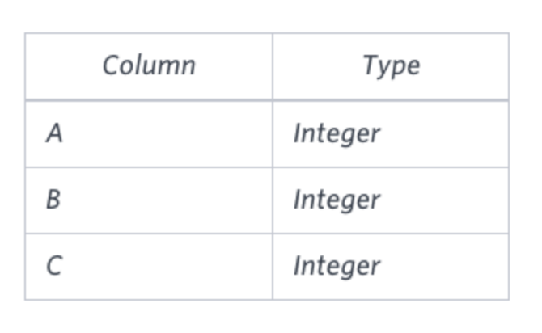

Write a query identifying the type of each record in the TRIANGLES table using its three side lengths. Output one of the following statements for each record in the table:
Equilateral: It's a triangle with  sides of equal length.
Isosceles: It's a triangle with  sides of equal length.
Scalene: It's a triangle with  sides of differing lengths.
Not A Triangle: The given values of A, B, and C don't form a triangle.
Input Format
The TRIANGLES table is described as follows:

Each row in the table denotes the lengths of each of a triangle's three sides.

```sql
select case 
            when (A+B<=C) or (A+C<=B) or (B+C<=A) then 'Not A Triangle'
            when (A=B) and (B=C) and (C=A) then 'Equilateral'
            when (A=B) or (B=C) or (C=A) then 'Isosceles'
            else 'Scalene'
        end as typeoftriangle from triangles;
```