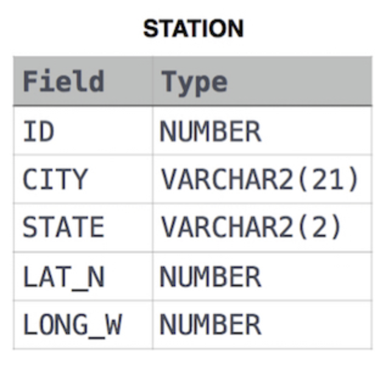

Query the list of CITY names from STATION that do not start with vowels. Your result cannot contain duplicates.
Input Format
The STATION table is described as follows:

where LAT_N is the northern latitude and LONG_W is the western longitude.

```sql
select distinct(city) from station
where city NOT LIKE 'a%' and city NOT LIKE 'e%'
and city NOT LIKE 'i%' and city NOT LIKE 'o%'
and city NOT LIKE 'u%';
```