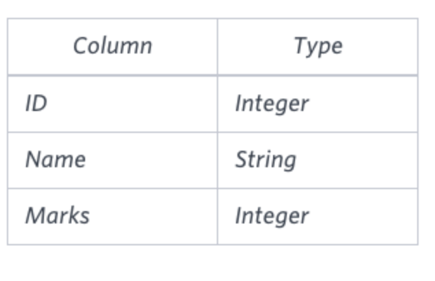
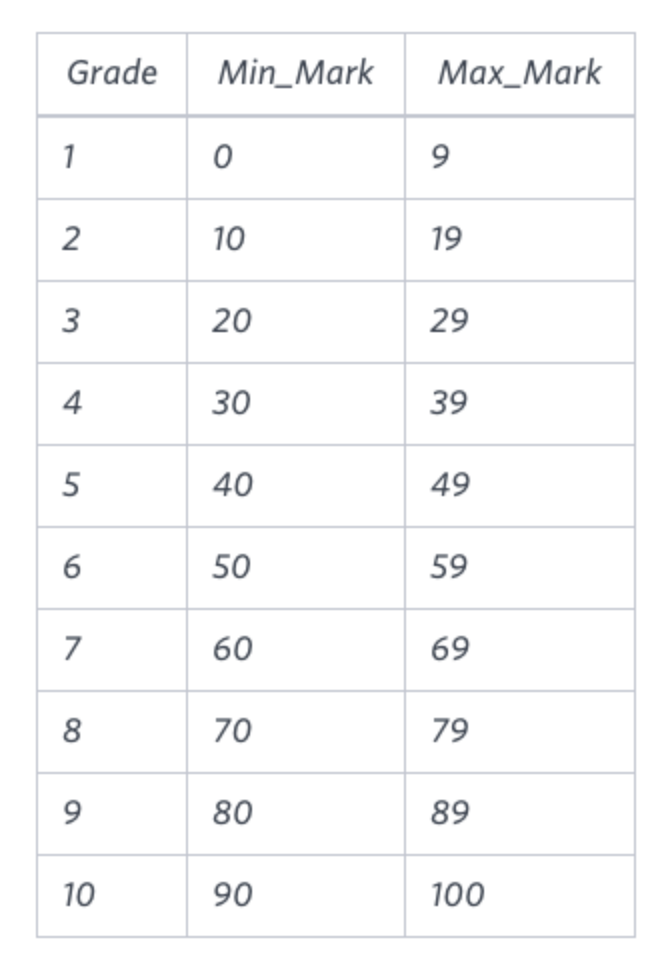

You are given two tables: Students and Grades. Students contains three columns ID, Name and Marks.




Grades contains the following data:


Ketty gives Eve a task to generate a report containing three columns: Name, Grade and Mark. Ketty doesn't want the NAMES of those students who received a grade lower than 8. The report must be in descending order by grade -- i.e. higher grades are entered first. If there is more than one student with the same grade (8-10) assigned to them, order those particular students by their name alphabetically. Finally, if the grade is lower than 8, use "NULL" as their name and list them by their grades in descending order. If there is more than one student with the same grade (1-7) assigned to them, order those particular students by their marks in ascending order.

Write a query to help Eve.


```sql
select case
            when grades.grade<8 then null
            else students.name end as names,
grades.grade,students.marks from students
cross join
grades
where students.marks between grades.min_mark and grades.max_mark
order by grades.grade desc, names asc;

```